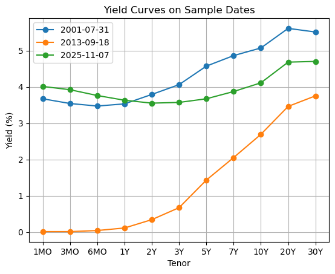
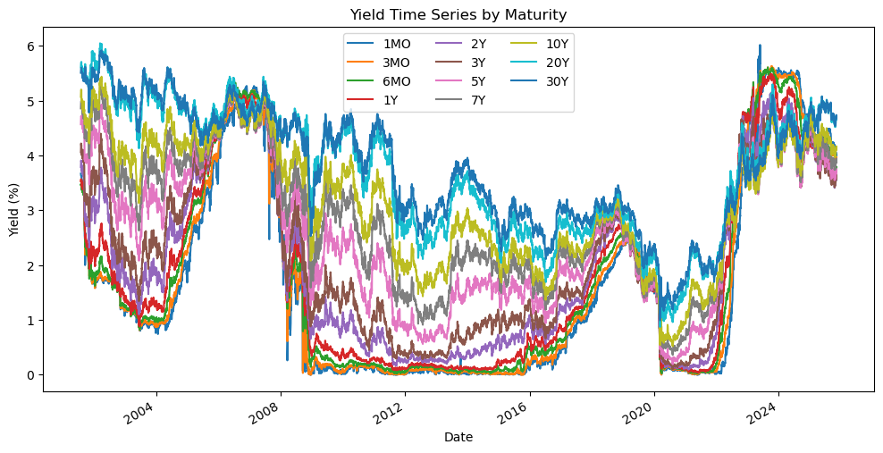
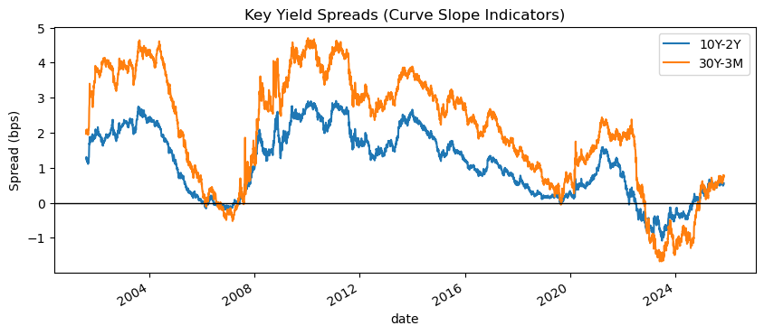
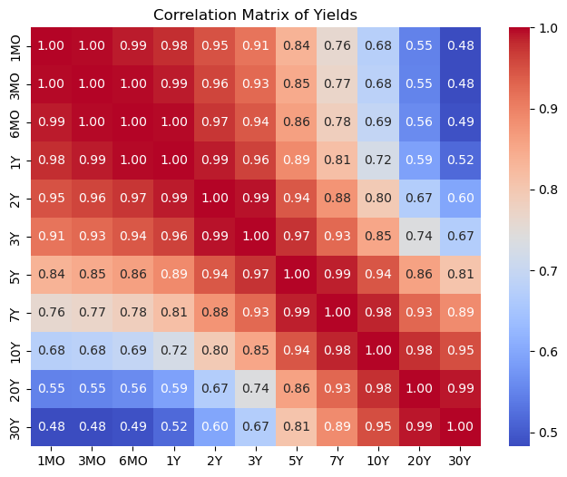
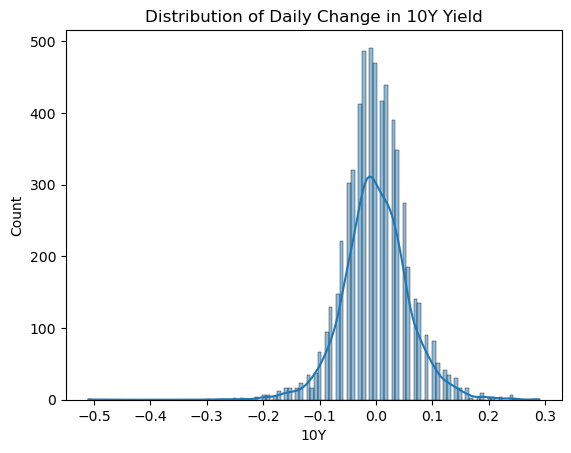
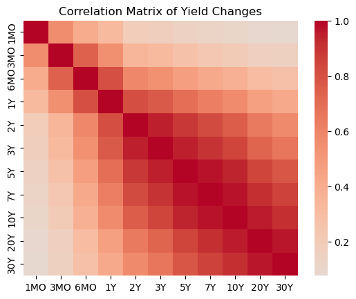
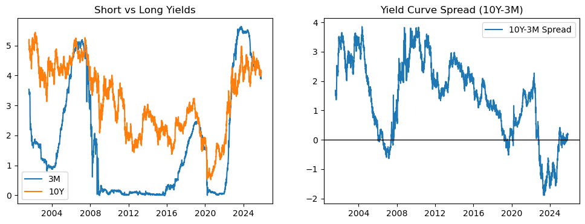
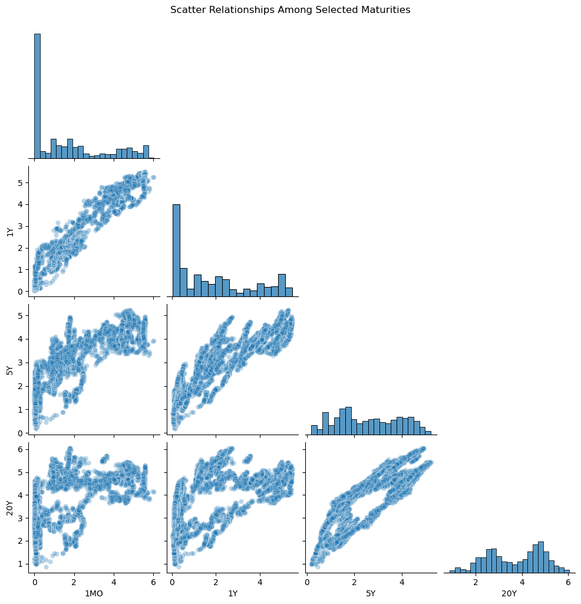

# EDA

## Load in Necessary Libraries to EDA Jupyter Notebook


```python
import pandas as pd
import numpy as np
import matplotlib.pyplot as plt
import seaborn as sns
```

## Load Data


```python
TENORS = ['1MO','3MO','6MO','1Y','2Y','3Y','5Y','7Y','10Y','20Y','30Y']
df = pd.read_csv("../data/processed/cleaned_data.csv", parse_dates=['date'])
df = df.set_index('date')
df.head()
```


<div>
<style scoped>
    .dataframe tbody tr th:only-of-type {
        vertical-align: middle;
    }

    .dataframe tbody tr th {
        vertical-align: top;
    }

    .dataframe thead th {
        text-align: right;
    }
</style>
<table border="1" class="dataframe">
  <thead>
    <tr style="text-align: right;">
      <th></th>
      <th>1MO</th>
      <th>3MO</th>
      <th>6MO</th>
      <th>1Y</th>
      <th>2Y</th>
      <th>3Y</th>
      <th>5Y</th>
      <th>7Y</th>
      <th>10Y</th>
      <th>20Y</th>
      <th>30Y</th>
    </tr>
    <tr>
      <th>date</th>
      <th></th>
      <th></th>
      <th></th>
      <th></th>
      <th></th>
      <th></th>
      <th></th>
      <th></th>
      <th></th>
      <th></th>
      <th></th>
    </tr>
  </thead>
  <tbody>
    <tr>
      <th>2001-07-31</th>
      <td>3.67</td>
      <td>3.54</td>
      <td>3.47</td>
      <td>3.53</td>
      <td>3.79</td>
      <td>4.06</td>
      <td>4.57</td>
      <td>4.86</td>
      <td>5.07</td>
      <td>5.61</td>
      <td>5.51</td>
    </tr>
    <tr>
      <th>2001-08-01</th>
      <td>3.65</td>
      <td>3.53</td>
      <td>3.47</td>
      <td>3.56</td>
      <td>3.83</td>
      <td>4.09</td>
      <td>4.62</td>
      <td>4.90</td>
      <td>5.11</td>
      <td>5.63</td>
      <td>5.53</td>
    </tr>
    <tr>
      <th>2001-08-02</th>
      <td>3.65</td>
      <td>3.53</td>
      <td>3.46</td>
      <td>3.57</td>
      <td>3.89</td>
      <td>4.17</td>
      <td>4.69</td>
      <td>4.97</td>
      <td>5.17</td>
      <td>5.68</td>
      <td>5.57</td>
    </tr>
    <tr>
      <th>2001-08-03</th>
      <td>3.63</td>
      <td>3.52</td>
      <td>3.47</td>
      <td>3.57</td>
      <td>3.91</td>
      <td>4.22</td>
      <td>4.72</td>
      <td>4.99</td>
      <td>5.20</td>
      <td>5.70</td>
      <td>5.59</td>
    </tr>
    <tr>
      <th>2001-08-06</th>
      <td>3.62</td>
      <td>3.52</td>
      <td>3.47</td>
      <td>3.56</td>
      <td>3.88</td>
      <td>4.17</td>
      <td>4.71</td>
      <td>4.99</td>
      <td>5.19</td>
      <td>5.70</td>
      <td>5.59</td>
    </tr>
  </tbody>
</table>
</div>


Yields appear to be importing correctly as percentages.

## Data Exploration


```python
print("=== Basic Info ===")
df.info()
print("=== Descriptive Stats ===")
display(df.describe().T)
print("=== Missing Values ===")
display(df.isna().sum())

```

    === Basic Info ===
    <class 'pandas.core.frame.DataFrame'>
    DatetimeIndex: 6071 entries, 2001-07-31 to 2025-11-07
    Data columns (total 13 columns):
     #   Column  Non-Null Count  Dtype  
    ---  ------  --------------  -----  
     0   1MO     6071 non-null   float64
     1   3MO     6071 non-null   float64
     2   6MO     6071 non-null   float64
     3   1Y      6071 non-null   float64
     4   2Y      6071 non-null   float64
     5   3Y      6071 non-null   float64
     6   5Y      6071 non-null   float64
     7   7Y      6071 non-null   float64
     8   10Y     6071 non-null   float64
     9   20Y     6071 non-null   float64
     10  30Y     6071 non-null   float64
     11  10Y-2Y  6071 non-null   float64
     12  30Y-3M  6071 non-null   float64
    dtypes: float64(13)
    memory usage: 793.1 KB
    === Descriptive Stats ===


<div>
<style scoped>
    .dataframe tbody tr th:only-of-type {
        vertical-align: middle;
    }

    .dataframe tbody tr th {
        vertical-align: top;
    }

    .dataframe thead th {
        text-align: right;
    }
</style>
<table border="1" class="dataframe">
  <thead>
    <tr style="text-align: right;">
      <th></th>
      <th>count</th>
      <th>mean</th>
      <th>std</th>
      <th>min</th>
      <th>25%</th>
      <th>50%</th>
      <th>75%</th>
      <th>max</th>
    </tr>
  </thead>
  <tbody>
    <tr>
      <th>1MO</th>
      <td>6071.0</td>
      <td>1.650252</td>
      <td>1.831137</td>
      <td>0.00</td>
      <td>0.07</td>
      <td>0.97</td>
      <td>2.60</td>
      <td>6.02</td>
    </tr>
    <tr>
      <th>3MO</th>
      <td>6071.0</td>
      <td>1.710784</td>
      <td>1.840977</td>
      <td>0.00</td>
      <td>0.10</td>
      <td>1.05</td>
      <td>2.87</td>
      <td>5.63</td>
    </tr>
    <tr>
      <th>6MO</th>
      <td>6071.0</td>
      <td>1.803357</td>
      <td>1.827836</td>
      <td>0.02</td>
      <td>0.15</td>
      <td>1.18</td>
      <td>3.14</td>
      <td>5.61</td>
    </tr>
    <tr>
      <th>1Y</th>
      <td>6071.0</td>
      <td>1.873485</td>
      <td>1.742095</td>
      <td>0.04</td>
      <td>0.26</td>
      <td>1.33</td>
      <td>3.28</td>
      <td>5.49</td>
    </tr>
    <tr>
      <th>2Y</th>
      <td>6071.0</td>
      <td>2.037839</td>
      <td>1.584988</td>
      <td>0.09</td>
      <td>0.61</td>
      <td>1.63</td>
      <td>3.48</td>
      <td>5.29</td>
    </tr>
    <tr>
      <th>3Y</th>
      <td>6071.0</td>
      <td>2.213910</td>
      <td>1.474596</td>
      <td>0.10</td>
      <td>0.93</td>
      <td>1.87</td>
      <td>3.62</td>
      <td>5.26</td>
    </tr>
    <tr>
      <th>5Y</th>
      <td>6071.0</td>
      <td>2.580311</td>
      <td>1.321897</td>
      <td>0.19</td>
      <td>1.51</td>
      <td>2.48</td>
      <td>3.80</td>
      <td>5.23</td>
    </tr>
    <tr>
      <th>7Y</th>
      <td>6071.0</td>
      <td>2.888022</td>
      <td>1.231006</td>
      <td>0.36</td>
      <td>1.91</td>
      <td>2.88</td>
      <td>3.97</td>
      <td>5.29</td>
    </tr>
    <tr>
      <th>10Y</th>
      <td>6071.0</td>
      <td>3.161199</td>
      <td>1.173000</td>
      <td>0.52</td>
      <td>2.18</td>
      <td>3.18</td>
      <td>4.20</td>
      <td>5.44</td>
    </tr>
    <tr>
      <th>20Y</th>
      <td>6071.0</td>
      <td>3.684892</td>
      <td>1.196298</td>
      <td>0.87</td>
      <td>2.66</td>
      <td>3.86</td>
      <td>4.73</td>
      <td>6.05</td>
    </tr>
    <tr>
      <th>30Y</th>
      <td>6071.0</td>
      <td>3.779906</td>
      <td>1.096847</td>
      <td>0.99</td>
      <td>2.94</td>
      <td>3.88</td>
      <td>4.69</td>
      <td>5.92</td>
    </tr>
    <tr>
      <th>10Y-2Y</th>
      <td>6071.0</td>
      <td>1.123360</td>
      <td>0.964962</td>
      <td>-1.08</td>
      <td>0.26</td>
      <td>1.18</td>
      <td>1.93</td>
      <td>2.91</td>
    </tr>
    <tr>
      <th>30Y-3M</th>
      <td>6071.0</td>
      <td>2.069122</td>
      <td>1.625938</td>
      <td>-1.67</td>
      <td>0.70</td>
      <td>2.29</td>
      <td>3.44</td>
      <td>4.70</td>
    </tr>
  </tbody>
</table>
</div>


    === Missing Values ===


    1MO       0
    3MO       0
    6MO       0
    1Y        0
    2Y        0
    3Y        0
    5Y        0
    7Y        0
    10Y       0
    20Y       0
    30Y       0
    10Y-2Y    0
    30Y-3M    0
    dtype: int64


Descriptive statistics appear reasonable and NA count appears consistent with prior data cleaning steps.


```python
sample_dates = [df.index[0], df.index[len(df)//2], df.index[-1]]

for date in sample_dates:
    plt.plot(TENORS, df.loc[date, TENORS], marker='o', label=date.strftime('%Y-%m-%d'))
    
plt.title('Yield Curves on Sample Dates')
plt.xlabel('Tenor')
plt.ylabel('Yield (%)')
plt.legend()
plt.grid()
plt.show()
```


    

    


Yield curves appear normal with typical upward slope. No anomalies detected on sample dates.


```python
df[TENORS].plot(figsize=(12,6))
plt.title("Yield Time Series by Maturity")
plt.ylabel("Yield (%)")
plt.xlabel("Date")
plt.legend(ncol=3)
plt.show()
```


    

    


Yields across time are difficult to track in this plot format but overall, appear to be reasonable. Spreads between yields appear to increase and decrease over time with yields appearing to typically be increasing across maturities, which is typical.


```python
df['10Y-2Y'] = df['10Y'] - df['2Y']
df['30Y-3M'] = df['30Y'] - df['3MO']

df[['10Y-2Y','30Y-3M']].plot(figsize=(10,4))
plt.axhline(0, color='k', lw=1)
plt.title("Key Yield Spreads (Curve Slope Indicators)")
plt.ylabel("Spread (bps)")
plt.show()
```


    

    


10Y-2Y and 30Y-3M spreads show inversion in 2007 and 2023. This is in alignment with inversions that occurred at those times.


```python
corr = df[TENORS].corr()
plt.figure(figsize=(8,6))
sns.heatmap(corr, cmap='coolwarm', annot=True, fmt=".2f")
plt.title("Correlation Matrix of Yields")
plt.show()
```


    

    


Correlations across maturities are above 0.95, suggesting strong comovement—ideal for dimensionality reduction.


```python
df_diff = df[TENORS].diff().dropna()
print(df_diff.describe().T[['mean','std']])


sns.histplot(df_diff['10Y'], kde=True)
plt.title("Distribution of Daily Change in 10Y Yield")
plt.show()
```

             mean       std
    1MO  0.000056  0.062841
    3MO  0.000063  0.043972
    6MO  0.000048  0.036986
    1Y   0.000016  0.041342
    2Y  -0.000040  0.054658
    3Y  -0.000081  0.058156
    5Y  -0.000148  0.061141
    7Y  -0.000163  0.061453
    10Y -0.000158  0.058301
    20Y -0.000153  0.055569
    30Y -0.000133  0.053848


    

    


Daily changes appear to be stationary at 10Y based off of distributions. For summary statistics, differences centered around 0 which indicates likely stationarity for remaining maturities.


```python
sns.heatmap(df_diff.corr(), cmap='coolwarm', center=0)
plt.title("Correlation Matrix of Yield Changes")
plt.show()
```


    

    


Strong positive correlation between nearby maturities demostrating yields tendencies to move together. As maturities distance, correlation diminishes.


```python
from statsmodels.tsa.stattools import adfuller

def adf_test(series):
    result = adfuller(series.dropna())
    return {'ADF Statistic': result[0], 'p-value': result[1]}

for t in ['1Y','5Y','10Y']:
    print(t, adf_test(df[t]))
```

    1Y {'ADF Statistic': np.float64(-1.2757389137803963), 'p-value': np.float64(0.6401974215608977)}
    5Y {'ADF Statistic': np.float64(-1.9628805090512111), 'p-value': np.float64(0.3030820072390974)}
    10Y {'ADF Statistic': np.float64(-2.1482120915461556), 'p-value': np.float64(0.225575084885962)}


All maturities fail ADF test meaning that undifferenced rates are non-stationary over time period.


```python
for t in ['1Y','5Y','10Y']:
    print(t, adf_test(df_diff[t]))
```

    1Y {'ADF Statistic': np.float64(-10.858776801933127), 'p-value': np.float64(1.464440940061537e-19)}
    5Y {'ADF Statistic': np.float64(-58.5389218927414), 'p-value': 0.0}
    10Y {'ADF Statistic': np.float64(-57.907586149023786), 'p-value': 0.0}


However, yields pass the ADF test when differences meaning that differences are stationary.


```python
fig, ax = plt.subplots(1,2, figsize=(12,4))
ax[0].plot(df.index, df['3MO'], label='3M')
ax[0].plot(df.index, df['10Y'], label='10Y')
ax[0].legend(); ax[0].set_title("Short vs Long Yields")
ax[1].plot(df.index, df['10Y'] - df['3MO'], label='10Y-3M Spread')
ax[1].axhline(0, color='k', lw=1)
ax[1].legend(); ax[1].set_title("Yield Curve Spread (10Y-3M)")
plt.show()
```


    

    


These results show:

1. Yields move together but short rates are more policy-sensitive.

2. Yield curve inversions align with tightening cycles and recessions.


```python
sns.pairplot(df[TENORS[::3]], corner=True, plot_kws={'alpha':0.3})
plt.suptitle("Scatter Relationships Among Selected Maturities", y=1.02)
plt.show()
```


    

    


```python
df_diff.to_csv("../data/processed/cleaned_with_changes.csv")
```
